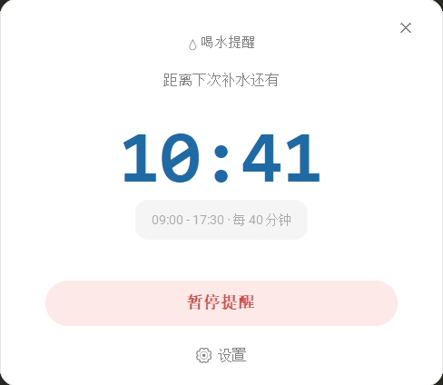
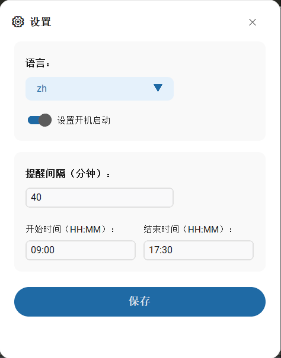
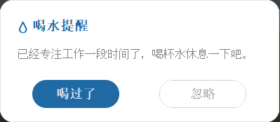

# 💧 Drink Water Reminder (喝水提醒)

一款基于 Python 和 CustomTkinter 构建的现代化桌面喝水提醒工具。它拥有圆角无边框的极简 UI 设计，支持系统托盘后台运行、自定义提醒时间段，并具备开机自启功能，能在你全神贯注工作时，温柔地守护你的饮水节奏。

## ✨ 核心特性

* **🎨 现代化的 UI 设计**：基于 `customtkinter` 构建，全应用采用无边框圆角卡片设计，支持拖拽，并完美兼容 Windows 系统的透明防撞色特性。
* **⏰ 智能时间区间**：不仅可以设置提醒的间隔时间（如每 45 分钟），还可以设定每日提醒的活跃时间段（如 09:00 - 17:30）。
* **🌙 勿扰/待机模式**：不在设定的时间范围内时，应用会自动进入静默待机状态，并在次日准时唤醒，不再打扰你的休息时间。
* **🚀 极简系统托盘**：最小化后自动隐藏至系统托盘，后台静默运行。托盘菜单支持快速打开设置、隐藏/显示主窗口以及退出程序。
* **🔔 Toast 浮窗通知**：从屏幕右下角优雅滑出的呼吸感通知窗口，提供“喝过了”和“忽略”选项，视觉柔和不突兀。
* **⚙️ 开机自启支持**：内置 Windows 注册表管理模块，可一键开启/关闭开机自启动。
* **🌐 多语言支持**：目前内置简体中文 (zh) 和英文 (en)，可在设置中无缝切换并实时生效。

## 📸 屏幕截图

|          主界面 (Main Window)           |    设置界面 (Settings)     |    弹窗提醒 (Notification)    |
|:------------------------------------:|:----------------------:|:-------------------------:|
|  |  |  |

## 🛠️ 技术栈

* **Python** 3.8+
* **[CustomTkinter](https://github.com/TomSchimansky/CustomTkinter)** - 提供现代化的深色/浅色模式 UI 组件。
* **[pystray](https://github.com/moses-palmer/pystray)** - 实现跨平台的系统托盘图标支持。
* **[Pillow](https://python-pillow.org/)** - 动态绘制系统托盘图标。

## 🤝 参与贡献
* **欢迎提交 Issue 和 Pull Request！**

* **Fork 本仓库**

* **创建您的特性分支 (git checkout -b feature/AmazingFeature)**

* **提交您的更改 (git commit -m 'Add some AmazingFeature')**

* **推送到分支 (git push origin feature/AmazingFeature)**

* **开启一个 Pull Request**

## 📄 许可证
本项目基于 MIT License 开源，您可以自由地使用、修改和分发。